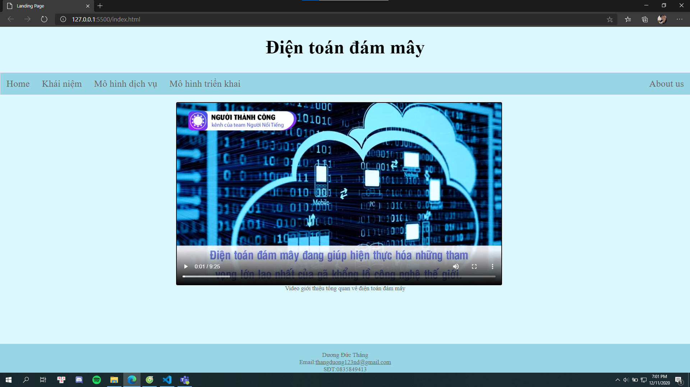
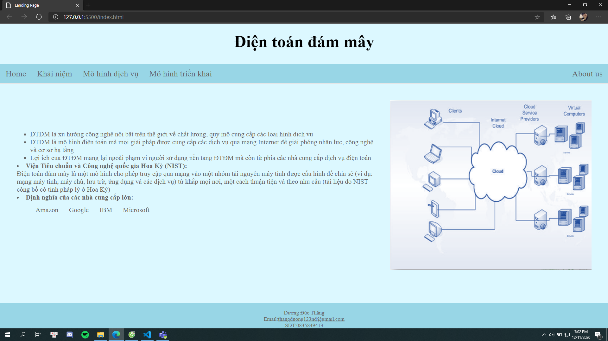

# Mã nguồn

```html
<html lang="en">

<head>
    <meta charset="UTF-8">
    <meta name="viewport" content="width=device-width, initial-scale=1.0">
    <title>Landing Page</title>
    <link rel="StyleSheet" href="./css/style.css">

    <script src="https://ajax.googleapis.com/ajax/libs/jquery/2.1.1/jquery.min.js"></script>

</head>

<body>
    <header>

        <h1 style="font-family: Times New Roman;color: black;">Điện toán đám mây</h1>
    </header>
    <nav>
        <ul>
            <li><a data-section="home">Home</a></li>
            <li><a data-section="services">Khái niệm</a></li>
            <li class="dropdown">
                <a href="javascript:void(0)" class="dropbtn">Mô hình dịch vụ</a>
                <div class="dropdown-content">
                    <a data-section="paas">PaaS</a>
                    <a data-section="iaas">IaaS</a>
                    <a data-section="saas">SaaS</a>
                </div>
            <li class="dropdown">
                <a href="javascript:void(0)" class="dropbtn">Mô hình triển khai</a>
                <div class="dropdown-content">
                    <a data-section="puc">Public cloud</a>
                    <a data-section="prc">Private cloud</a>
                    <a data-section="hyc">Hybrid cloud</a>
                    <a data-section="coc">Community cloud</a>
                </div>
            </li>
            <li style="float:right"><a data-section="about">About us</a></li>
        </ul>
    </nav>

    <section id="home" class="hideable-section">
        <div>
            <div>
                <video max-width="800" max-height="450" controls>
                    <source src="dtdm.mp4" type="video/mp4">
              
            </div>
            <p style="text-align: center;">  Video giới thiệu tổng quan về điện toán đám mây</p>
        </div>
        </div>
    </section>

    <section id="services" class="hideable-section">
        <div class="grid-container">
            <div class="grid-item">
                <ol style="list-style-type:square;padding-top: 90px;">
                    <li>ĐTĐM là xu hướng công nghệ nổi bật
                        trên thế giới về chất lượng, quy mô cung cấp các loại hình dịch vụ</li>
                    <li>ĐTĐM là mô hình điện toán mà mọi giải
                        pháp được cung cấp các dịch vụ qua
                        mạng Internet để giải phóng nhân lực,
                        công nghệ và cơ sở hạ tầng</li>
                    <li>Lợi ích của ĐTĐM mang lại ngoài phạm
                        vi người sử dụng nền tảng ĐTĐM mà
                        còn từ phía các nhà cung cấp dịch vụ
                        điện toán</li>
                </ol>

                <li><strong>Viện Tiêu chuẩn và Công nghệ
                        quốc gia Hoa Kỳ (NIST):</strong>
                    <p>Điện toán đám mây là một mô hình
                        cho phép truy cập qua mạng vào một
                        nhóm tài nguyên máy tính được cấu
                        hình để chia sẻ (ví dụ: mạng máy tính,
                        máy chủ, lưu trữ, ứng dụng và các
                        dịch vụ) từ khắp mọi nơi, một cách
                        thuận tiện và theo nhu cầu (tài liệu do
                        NIST công bố có tính pháp lý ở Hoa Kỳ)</p>
                </li>
                <li><strong>Định nghĩa của các nhà cung cấp lớn:</strong>
                    <ol style="list-style-type:none">
                        <li class="list"><a
                                href="https://docs.aws.amazon.com/whitepapers/latest/aws-overview/what-is-cloud-computing.html"
                                target="blank">Amazon</a></li>
                        <li class="list"><a href="https://cloud.google.com/what-is-cloud-computing "
                                target="blank">Google</a></li>
                        <li class="list"><a href="https://www.ibm.com/cloud/learn/cloud-computing"
                                target="blank">IBM</a></li>
                        <li class="list"><a href="https://azure.microsoft.com/en-us/overview/what-is-cloud-computing "
                                target="blank">Microsoft</a></li>
                    </ol>
                </li>
            </div>
            <div class="grid-item">
            </div>

    </section>

    <section id="about" class="hideable-section">
        <div>About content</div>
    </section>

    <section id="paas" class="hideable-section">
        <div>
           PaaS content
        </div>
    </section>

    <section id="iaas" class="hideable-section">
        <div>Iaas content</div>
    </section>

    <section id="saas" class="hideable-section">
        <div>Saas content</div>
    </section>

    <section id="puc" class="hideable-section">
        <div>Public cloud content</div>
    </section>

    <section id="prc" class="hideable-section">
        <div>Private cloud content</div>
    </section>

    <section id="hyc" class="hideable-section">
        <div>Hybrid cloud  content</div>
    </section>

    <section id="coc" class="hideable-section">
        <div>Community cloud content</div>
    </section>
<footer style="text-align: center;">
    <p>Dương Đức Thắng</p>
    <P>Email:<a href="thangduong123nd@gmail.com">thangduong123nd@gmail.com</a></P>
    <p>SĐT:0835849413</p>
</footer>
    
    <script>
        $(function () {
            $('nav ul li a').click(function () {
                // Lấy section để hiển thị
                var $section = $('#' + $(this).data('section'));

                // Nếu đang hiện thì không làm gì.
                // Nếu không, ẩn tất cả các se cho hiện (kiểu fade in) phần mong muốn.
                if (!$section.is(':visible')) {
                    $('.hideable-section').hide();
                    $section.fadeIn();
                }
            });
        });
    </script>
</body>

</html>
```
```css
* {
    margin: 0;
    box-sizing: border-box;
    color: #666;
    font-family: Didot;
}
body{
   background-color: #dcf8ff;
   
}

/* Header/logo tiêu đề */

header {
    padding: 5px;
    text-align: center;
    background: #dcf8ff;
    color: white;
    height: 120px;
    padding-top: 25px;
    
}


/* Tăng kích thước font chữ cho header */

header h1 {
    font-size: 50px;
}

header h1,
h2,
h3 {
    color: white;
}

section {
    padding: 20px;
}

ul  {
    list-style-type: none;
    margin: 0;
    padding: 0;
    overflow: hidden;
    border: 1px solid #e7e7e7;
    background-color: #98d6e6;
    font-size: 25px;
}

li {
    float: left;
}

li a,
.dropbtn {
    display: inline-block;
    color: #666;
    text-align: center;
    padding: 14px 16px;
    text-decoration: none;
}

li a:hover:not(.active),
.dropdown:hover .dropbtn {
    color: white;
    background-color: #42c7e8;
}

li.dropdown {
    display: inline-block;
}

.dropdown-content {
    display: none;
    position: absolute;
    background-color: #f9f9f9;
    min-width: 160px;
    box-shadow: 0px 8px 16px 0px rgba(0, 0, 0, 0.2);
    z-index: 1;
}

.dropdown-content a {
    color: #666;
    padding: 12px 16px;
    text-decoration: none;
    display: block;
    text-align: left;
}

.dropdown-content a:hover {
    background-color: #f1f1f1;
}

.dropdown:hover .dropdown-content {
    display: block;
}


/* Landing page */

.hideable-section {
    display: none;
}

.hideable-section:first-of-type {
    display: block;
}
.grid-container {
    display: grid;
    grid-template-columns: auto auto;
   
    padding: 10px;
  }
  .grid-item {
    padding: 20px;
    font-size: 20px;
   
   }
footer{
    position: sticky;
    top: 100%;
    background-color:  #98d6e6;
    max-width: 100%;
    
   
    padding-top: 20px;
    text-align: center;
}
@media screen and (max-width:800px){
    video{
        width: 300px;
        height: 200px;
        position: relative;
        left: 20%;
        right: 25%;
    }
}
video{
    position: relative;
    left: 25%;
    right: 25%;
}
  
```
# Kết quả


